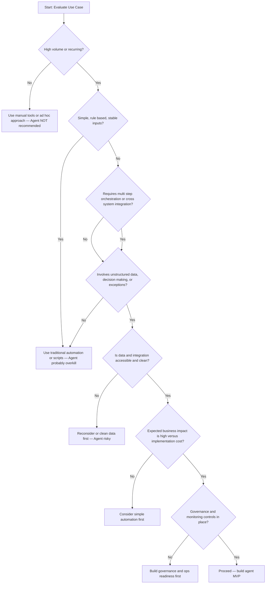

https://learn.microsoft.com/en-us/training/paths/maximize-cost-efficiency-ai-agents/

# Identify and Priortise High-Impact AI Agent Use Cases

Using the existing use-cases when researching the cost efficiency of AI agents provides a reliable benchmark for evaluating potential return on investment. Such use cases show how AI agents have been deployed to reduce __operationla cost, improve productivity, streamline workflows__ in comparable envrionments.By analyzing outcomes such as time savings, automation rates, and resource utilization, organizations can make informed projections about cost efficiency without relying solely on theoretical models. Search this link https://www.microsoft.com/en-au/customers/search?q=AI+Agents&filters=industry%3Aretail-consumer-goods

## Identify Business Needs and Define AI Use Cases

In other to priortise the uses cases for AI agents consider the following pillars. They are more or less related to Azure Well Architected Framework.

*  __Reduce Overhead (WAF Cost Optimisation)__ : Agents work well when the process is high-volume, repetitive and rule-based. Good Orchestration pattern is __sequential__.
    *  Examples: Invoice processing, Employee onboarding. AI agents are not good for small-valume manual tasks or executive decision making.
*  __Streamline Resource Allocation (WAF Cost Optimisation and Performance Efifciency)__: AI Agents work when tasks can be modularised and scaled efficiently.
   *  Examples:: Good for logistic routing agents where modular agents plan delivery routes, warehouse picking. Not good if a monolithioc agent does all the tasks or highly variable.
*  __Improve Scalability (WAF Operational Excellence)__ : Agents work well when the workload volume fluctuates and automaton can absorbe the peaks.
  *  Examples: Insurance claim agents (can manage peak time request through automation), customer service virtual agents. Not good for use cases with static and low-volum data.
*  __Drive Productivity Gains (WAF Operational Excellence, Performance Efficiency)__: Agents work when they automate workload bottlenecks and augment human decision-making.
   *  Examples: Good for Expanase Management Agents (check policy compliance), Sales proposal agent (draft the sales proposal based on CRM data), Code Reviewing Agents (Statis analysis). Not goot for cross-depratment approvals or creative ideation.
 *   __Enhance Customer Satisfaction (WAF?)__: Agents work well when the customer expect 24/7 consistent responses
     *  Examples: Retail chat agent. Not good for complex sales negotiations.
*  __Support Revenue Growth (WAF?)__: Agents work very well when they detects workload opportunites or identify risks at scale.
    *  Examples: Upsale cross-sale recommendations, Chrun prediction agents
 
## Identify Quick Wins

After identifying use cases, it is good to identify effective solutions that can be delivered quickly. Consider the following factors:

* __Low Implentation complexity__: Choose use cases with fewer integration requirments and less deep hooks into the legacy system and cross-depratment coordination. Pick ups use cases that can be build on top of the SaaS platfroms or internal tools with exposed APIs. Favour cases with structured and accessible data over unstrcutured or siloed data.
* __High Financial Impacts__: Consider meterics such as Cost saving (reduced labour hour, low error rates), Efficiency (Faster cycle time, fewer manual steps), Revenuw Uplift (increased converesion, upsell and retention)

# When to Use an AI Agent — Decision Flowchart

