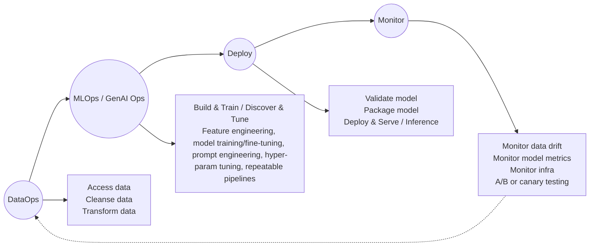

https://learn.microsoft.com/en-us/azure/well-architected/ai/mlops-genaiops

# Introduction

Workload tasks can be categorised into three main areas: Application Development, Data Handling, and AI model management. Each category should adopt industry-proven operational methodologies such as __DataOps, MLOps, GenAIOps, and DevOps__.

DevOps activites cover the lifecycle of application development through Continous Integration and Continous Deployment (CI/CD) pipelines and monitoring. DataOps managing the data lifecycle by streamlining the ETL/ELT. DataOpes focuses on data flow performance, efficiney of cleaning and monitoring pipelines for anomalies.

AI workloads are non-determinstic in nature, hence such workloads need process that can manage the unpredictibility of AI outputs, hence MLOps which opertionalises the ML workloads for model training, tuning, and inferencing are required. GenAIOps a subset of MLOps targets Genai solutions and it involves tasks like model discovery and  refining pretrained models with enrished data.

Overal goal of xOps is to deliver capability with efficient operations through the lifecycle of development. The expected outcomes are:

* Repeatable process with consistent results
* Sustained accuracy of the models over time
* Efficient governance that minimize the risks
* Change management process for dapating to model drift.
  
__Automation and monitoring are key operational strategies__ to achieve such goals.

This article focuses on the design strategies for operations and provides tool recommendation.

Recommendations in this article

# ✅ Recommended Practices for Operating AI / ML Workloads

| **Recommendation** | **Description / What It Means** |
|--------------------|----------------------------------|
| **Design an efficient workload operations lifecycle** | For AI workloads, define and implement clear lifecycle stages — from data ingestion, training, to deployment, monitoring and updates. Use appropriate practices depending on workload type (ML, traditional ML, Gen-AI, etc.). Plan for DataOps, MLOps / GenAIOps, monitoring and lifecycle management. |
| **Automate everything** | Automate as much as possible — data pipelines, model training & deployment, testing, monitoring — to ensure repeatability, reduce human error, and speed up iteration.  |
| **Use deployment pipelines where possible** | Define deployment pipelines (e.g. CI/CD) not just for code, but for data, model packaging, deployment, versioning, validation, and rollout. This helps ensure reproducibility, traceability, and safer promotion to production.  |
| **Prevent drift and decay in your models** | Once in production, models tend to degrade over time (data drift, distribution shifts, changing business context). Have a process for monitoring, evaluating performance, triggering retraining or deprecation when needed, and maintaining version lineage / audit trail. |

# Workload Operation Lifecycle

The following image provides the operational stages for AI models, including ETL to model deployment. 

For each kind of workloads, i.e., dataOps, MlOps, etc. the following shows the common operaional practices.

## DataOps

Data is aggreegated from various resource to remove errors and inconsistencies and handling missing values. finally, it is transformed and normlised into a suitable foramt for training or enrichsment. The __data processing operations__ in this stage must be fiicient to handle large volume of data and complex data pipelines to ensure that high-quality data is produced and monitor this stage to track the progress toward the acceptable quality bar. The DataOps need to ensure that data handling and accessing data is secured as production level data need to be proccessed and be promoted from test to prod enverionments.

__Recommended Tools__: Azure DataFactroy, Azure Machine Learning piplines

## MLOps

Model training is the process where data scientists experiment with available data to identify the best performing models. This experimentation can be costly and often needs to be repeated multiple times — ideally in an automated fashion.

Once the optimal model configuration is identified, the model and all associated artifacts (for example: the trained model itself, runtime environment, container images, package dependencies, etc.) must be deployed. Critically, this entire pipeline should be automated, minimizing manual “click ops.”

__Recommended tool__: A good off-the-shelf solution is MLflow on Azure Machine Learning — it integrates with source-control systems (like GitHub or Azure DevOps) and supports the full machine-learning lifecycle including experiment tracking, model versioning, and deployment.

## GenAIOps

The main activity in this stage is to discover and evaluate existing models to identify those that are already pretrained for the target use case. It’s an iterative process: once a suitable model is found, it may need to be refined or adapted for domain-specific grounding. Because of this, beyond traditional MLOps pipelines you also need model orchestration capabilities, efficient model evaluation, and vector-store / embedding index support.

__Recommended tools__: Use the pretrained models listed in the Azure Machine Learning model catalog (or “Foundry / Model Catalog”) 
. To orchestrate and manage LLM-based workloads — including prompt flows, pipelines, testing and deployment — combine that with PromptFlow, which integrates tightly with Azure ML and supports flows for prompts, code, evaluation, and deployment.

